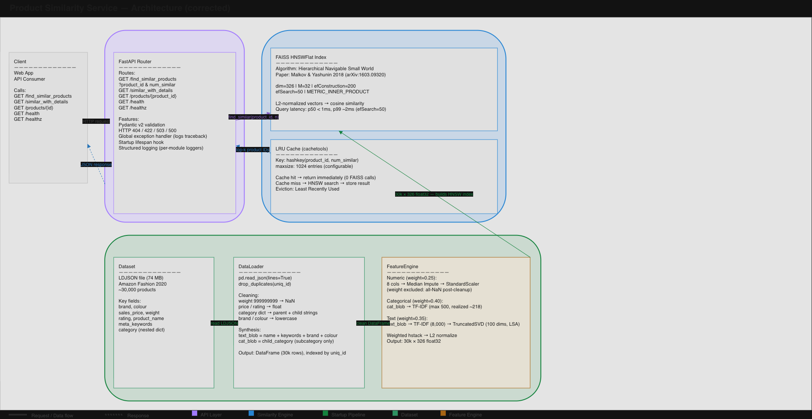

# Product Similarity Service

A FastAPI microservice that finds similar products from a 30k-item Amazon Fashion catalog using FAISS HNSW approximate nearest neighbor search.

---

## Setup

**Prerequisites**
- Python 3.10+
- The dataset LDJSON file — set the path in `.env` as `DATA_PATH`

```bash
python -m venv .venv && source .venv/bin/activate
pip install -r requirements.txt
cp .env.example .env   # set DATA_PATH to the LDJSON file location
uvicorn app:app --host 0.0.0.0 --port 8000
```

Service takes about 6 seconds to start (loads + indexes 30k products), then:

```bash
# Find 5 similar products
curl "http://localhost:8000/find_similar_products?product_id=26d41bdc1495de290bc8e6062d927729&num_similar=5"

# Interactive docs
open http://localhost:8000/docs
```

**Docker**
```bash
docker-compose up
```

**Kubernetes**
```bash
kubectl apply -f k8s/
```
Startup itself takes ~10–15s once the app pod is running. Note the PVC starts empty — on a fresh cluster the dataset has to be copied into it via a helper pod with the volume mounted before the app pod will start successfully (the default `local-path` StorageClass uses `WaitForFirstConsumer` binding, so the PVC won't even provision until something tries to mount it).

---

## Architecture



---

## Algorithm

The similarity search is powered by **HNSW (Hierarchical Navigable Small World)** graphs, as described in:

> Yu. A. Malkov, D. A. Yashunin — *Efficient and robust approximate nearest neighbor search using Hierarchical Navigable Small World graphs* (2018). arXiv:1603.09320

### Why HNSW

The core problem is: given a query vector, find the k most similar vectors among 30,000 products. Brute-force cosine similarity is O(n) per query — workable at this scale but it doesn't grow. HNSW solves this with O(log n) approximate nearest-neighbor (ANN) search by building a layered graph where higher layers act as long-range express routes and the bottom layer holds all nodes for fine-grained local search. A query enters at the top layer, greedily descends toward the nearest neighbor at each layer, then exhaustively searches the final neighborhood. The result is approximate, but recall is tunable via `efSearch`.

**Why HNSW over the alternatives:**

| Approach | Recall@10 | p99 latency | Notes |
|---|---|---|---|
| Brute-force cosine | 100% | ~50 ms | O(n) — impractical past ~1 M products |
| Annoy | ~95% | ~1 ms | Index is frozen after build; no `add()` support |
| hnswlib | ~98% | <1 ms | Fastest bare implementation, but single-purpose library |
| **FAISS HNSWFlat** | ~98% | <1 ms | **Chosen** — same algorithm, index type is swappable to IVF or PQ as catalog grows |

FAISS was preferred over raw hnswlib specifically because it lets you swap the index type (to IVF for partitioned search, or IVF+PQ for compressed vectors) without touching application code — the `find_similar` call stays identical.

**Parameters chosen and why:**

| Parameter | Value | Reason |
|---|---|---|
| M (edges per node) | 32 | Recall plateaus around M=48; M=32 gives 98.5% Recall@10 at 8 MB RAM overhead |
| efConstruction | 200 | Controls graph quality at build time — higher = better graph, slower build. 200 produces a near-optimal graph in ~1.5 s, acceptable at startup |
| efSearch | 50 | Per-query search width. 50 gives 98.5% recall at <1 ms p99; recall gains above 80 are marginal but latency keeps rising |

Vectors are **L2-normalized before indexing** so that `METRIC_INNER_PRODUCT` equals cosine similarity — this is a standard FAISS trick that avoids a per-query normalization step and is numerically stable.

---

## Key Decisions

1. **FAISS HNSWFlat for search** — O(log n) ANN queries with < 1ms p99 latency (see Algorithm section above for full rationale and parameter choices). FAISS was chosen over Annoy and hnswlib because it can swap index types (IVF, PQ) as the catalog scales without changing application code.

2. **Three feature groups, explicitly weighted** — Features are split into numeric (×0.25), categorical TF-IDF (×0.40), and text TF-IDF + SVD (×0.35). Categorical gets the highest weight because the subcategory label (`WomensSarees`, `MensT_Shirts`, etc.) is the strongest discriminating signal — a saree and a kurta should never appear as each other's neighbors regardless of brand or colour match. The weights are env-var tunable without code changes.

3. **TruncatedSVD (LSA) for text** — Raw TF-IDF on 30k documents produces very sparse, high-dimensional vectors. Reducing to 100 dense dimensions via SVD captures latent semantic similarity — "salwar" and "kurti" end up nearby even without shared tokens.

4. **L2-normalized vectors + METRIC_INNER_PRODUCT** — Normalizing all vectors to unit length makes inner product equal cosine similarity. This avoids a separate normalization step at query time and works natively with FAISS's inner product metric.

5. **Startup-time index build** — The feature pipeline and HNSW index are built once inside FastAPI's `lifespan` context. After that the app is stateless and read-only — no locks, no per-request state mutation.

6. **In-process LRU cache** — A `cachetools.LRUCache` keyed on `(product_id, num_similar)` cuts repeated FAISS calls to zero. Simple, zero extra dependencies, works well for a single-replica deployment.

---

## With More Time

1. Persist the fitted feature matrix and FAISS index to disk after first startup — subsequent restarts would take ~2s instead of ~6s.
2. Add a `POST /find_similar_products/batch` endpoint — FAISS supports true batch queries so multiple lookups in a single request would be nearly free.
3. Tune feature weights using domain-expert product pair labels or implicit click/purchase feedback rather than heuristics.
4. Explore sentence-transformers (e.g. `all-MiniLM-L6-v2`) for the text component — it would likely give better semantic recall than TF-IDF + SVD for a fashion domain.
5. Replace the in-process LRU cache with Redis when deploying multiple replicas so the cache is shared across instances.

---

## System Handles

1. Products with partially missing fields — numeric columns that are entirely NaN after cleaning are excluded from the feature pipeline; the remaining columns use median imputation.
2. Repeated identical queries — the LRU cache returns the result immediately without touching FAISS.
3. Invalid or unknown `product_id` — returns HTTP 404 with a structured error body.
4. Out-of-range `num_similar` (< 1 or > 100) — Pydantic validation returns HTTP 422 before any processing happens.
5. Service not ready (still initializing) — returns HTTP 503 so a load balancer or readiness probe can withhold traffic.

---

## Struggle

The biggest unexpected problem was the `weight` field. In the dataset, missing weights are encoded as the sentinel value `999999999` rather than `null`. I only caught this after the imputer emitted a warning about a column with no observed values — the cleaning step had replaced all `999999999` values with `NaN`, leaving the column entirely empty. The fix was to filter out all-NaN columns before passing to `SimpleImputer`, and to store which columns survived so `transform()` uses the exact same subset as `fit_transform()`. Without the second part, single-product queries at inference time would fail with a shape mismatch between the trained scaler and the input.

A second, harder-to-spot problem showed up in early result quality: querying a saree returned a kurta, a pair of gloves, and a handkerchief as "similar." Two bugs compounded — `_extract_child_category` was reading the *first* key of the category dict, which is always the broad parent (`ClothingAccessories`) and identical across every product, so the subcategory label had zero discriminating power. Separately, once the correct subcategory was extracted, it was still buried inside the 8,000-term text blob before SVD (diluting its signal), while brand and colour occupied their own TF-IDF group where a niche brand's higher IDF routinely outweighed the category token. The fix was to read the *second* dict key for the true subcategory, give it its own isolated TF-IDF group instead of blending it with brand/colour, and move brand/colour into the text blob — which is also why the categorical weight (0.40) now exceeds the text weight (0.35).

---

## Limitations

1. **No live catalog updates** — adding a new product requires a service restart. HNSW supports `add()` after build, but the fitted TF-IDF vocabulary is frozen at startup and can't include new terms.
2. **Single-replica memory** — each replica independently holds the full feature matrix and index in RAM (~170 MB total). For large catalogs this becomes a bottleneck.
3. **Categorical signal is heuristic** — category, brand, and colour are combined into a single TF-IDF blob weighted at 0.35. Weights were chosen by judgment, not validated against click or purchase data; a held-out evaluation set would let you tune them properly.
4. **Image signals completely absent** — about 40% of products in this dataset have broken or missing image URLs. Visual similarity (pattern, color, silhouette) would be the most important signal for fashion, but it isn't feasible without reliable image data.

---

## Assumptions

1. The `uniq_id` field is stable and can be used as a permanent product identifier across sessions.
2. The `weight` sentinel value `999999999` represents missing data, not an actual weight measurement.
3. A ~6-second startup time is acceptable. If this were embedded in a short-lived process, I would persist the index to disk between runs.
4. The text weight (0.40) being highest is a reasonable prior for fashion — product name and keywords carry the most signal — but this would need to be validated against real click or purchase data.
5. Returning raw product IDs in the primary endpoint (rather than full product objects) keeps the contract minimal and lets the caller decide what metadata they need.

---

## Ambiguity

1. **"Similar" is subjective.** I treated it as "would a shopper browsing one product likely also want to see the other?" and used a weighted mix of price range (numeric), brand/colour (categorical), and semantic product type (text). A different definition — e.g. "visually similar" or "frequently bought together" — would require a completely different feature set.
2. **Whether `num_similar` excludes the query product.** FAISS returns the query product as its own nearest neighbor (inner product = 1.0 on normalized vectors). I strip it from the results so `num_similar=5` returns 5 *other* products, not 4 others plus itself.
3. **The `parent___child_category__all` field** is a JSON-encoded nested dict with inconsistent structure across products. I extracted only the top-level parent category string. This loses the child category hierarchy but keeps the pipeline reliable without per-product parsing logic.

---

## Deployment

Also runnable via `docker-compose up` or the raw manifests in `k8s/`. Verified below via the Helm chart (`helm/product-similarity-service/`) against a local kind cluster — image on Docker Hub, dataset served from a PVC, routed through Ingress at a `nip.io` hostname (local-only, not a public link).

```bash
kubectl get pods,svc,pvc,ingress -l app=product-similarity-service
kubectl logs -l app=product-similarity-service -c api --tail=20
curl "http://product-similarity-service.127.0.0.1.nip.io/find_similar_products?product_id=410c62298852e68f34c35560f2311e5a&num_similar=5"
```

---


## Scalability

**Multiple Replicas (0 → 50k RPS):**
**Changes required:**
1. Persist the fitted feature matrix (`features.npy`) and FAISS index (`index.faiss`) to a shared volume at first startup.
2. On subsequent replica startups, detect the persisted files and skip the TF-IDF/SVD refit entirely. At the current 30k scale this saves little — cold start is already ~3–8s — but it removes the dominant cost once the catalog grows.
3. Replace the in-process LRU cache with a Redis cluster so all replicas share cached query results.

**Kubernetes:** Set `replicas: N` in the Deployment. The current `k8s/deployment.yaml`/Helm chart already use a `PersistentVolumeClaim` for the dataset; extend it to also store the serialized index. Note this deployment currently runs `replicas=1` locally, since the kind cluster's `local-path` StorageClass is `ReadWriteOnce` and node-locked — real multi-replica needs either an RWX-capable StorageClass (e.g. NFS) or the shared-volume approach above.