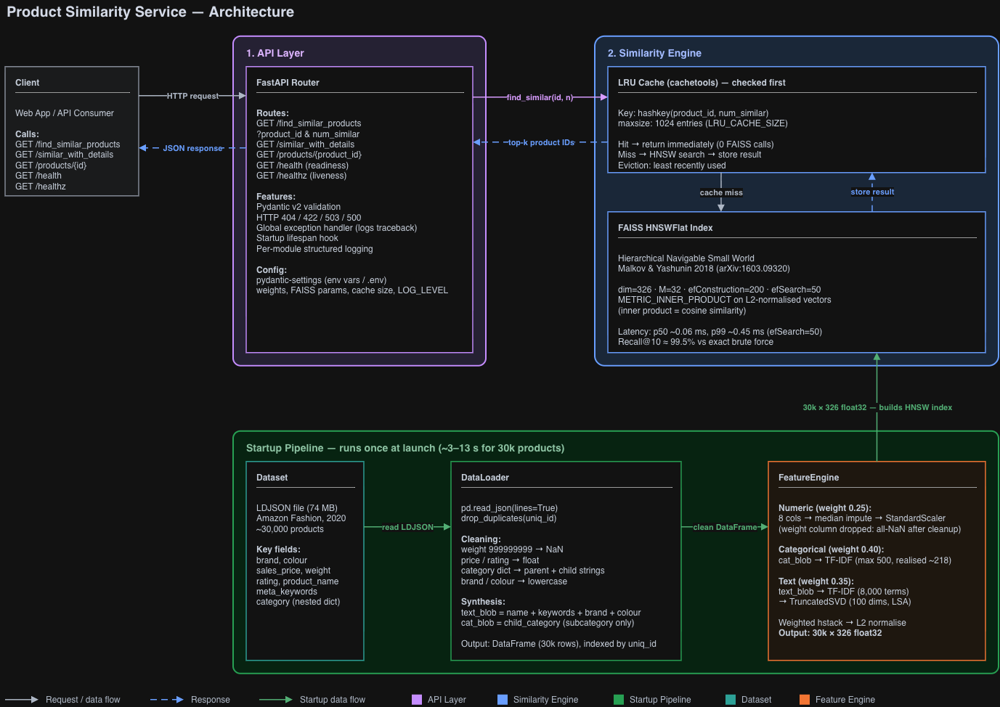
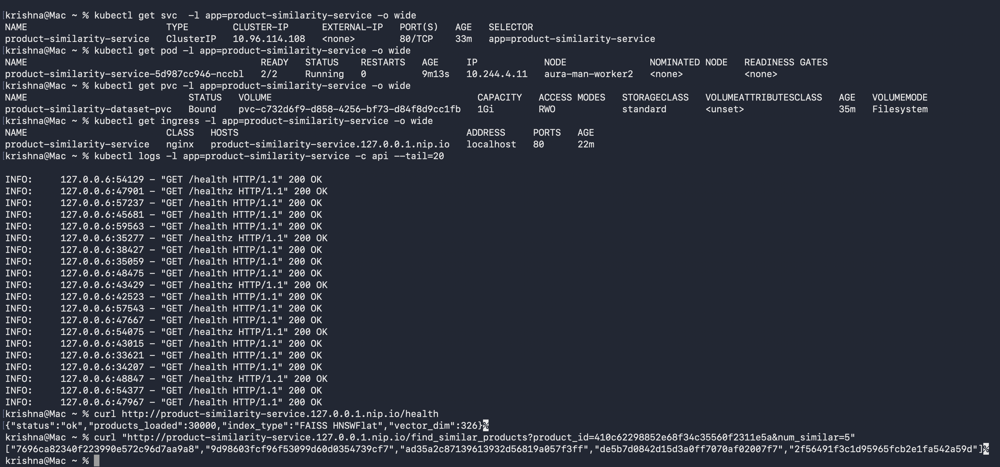

# Product Similarity Service

A FastAPI microservice that finds similar products from a 30k-item Amazon Fashion catalog using FAISS HNSW approximate nearest neighbor search.

---

## Setup

**Prerequisites**
- Python 3.10+
- The dataset LDJSON file — place it at `data/marketing_sample_for_amazon_com-amazon_fashion_products__20200201_20200430__30k_data.ldjson` (the default `DATA_PATH`), or set `DATA_PATH` in `.env` to wherever it lives. It isn't in the repo.

```bash
python -m venv .venv && source .venv/bin/activate
pip install -r requirements.txt
cp .env.example .env   # set DATA_PATH to the LDJSON file location
uvicorn app:app --host 0.0.0.0 --port 8000
```

Startup (load, clean, featurise and index 30k products) takes roughly 3–13 seconds depending on hardware (measured: ~3 s locally, ~7 s in Docker, ~12 s in the k8s pod), then:

```bash
# Find 5 similar products
curl "http://localhost:8000/find_similar_products?product_id=26d41bdc1495de290bc8e6062d927729&num_similar=5"

# Interactive docs
open http://localhost:8000/docs
```

**Docker**
```bash
docker-compose up
```

**Kubernetes** (raw manifests; the Helm route is under [Deployment](#deployment))
```bash
kubectl apply -f k8s/
kubectl apply -f k8s/seed/data-seed-pod.yaml && kubectl wait --for=condition=Ready pod/data-seed --timeout=120s
kubectl cp data/marketing_sample_for_amazon_com-amazon_fashion_products__20200201_20200430__30k_data.ldjson data-seed:/data/
kubectl delete pod data-seed
```
The dataset lives on a PVC rather than in the image, so it has to be copied in once; the app pod starts (or restarts itself) once the file exists. The seed pod is needed because `local-path`-style StorageClasses use `WaitForFirstConsumer`: the volume isn't provisioned until a pod mounts the claim. Tested on a clean namespace: ready ~1 minute after seeding.

---

## Architecture



---

## Algorithm

The similarity search is powered by **HNSW (Hierarchical Navigable Small World)** graphs, as described in:

> Yu. A. Malkov, D. A. Yashunin — *Efficient and robust approximate nearest neighbor search using Hierarchical Navigable Small World graphs* (2018). arXiv:1603.09320

### Why HNSW

The core problem is: given a query vector, find the k most similar vectors among 30,000 products. Brute-force cosine similarity is O(n) per query — workable at this scale but it doesn't grow. HNSW solves this with O(log n) approximate nearest-neighbor (ANN) search by building a layered graph where higher layers act as long-range express routes and the bottom layer holds all nodes for fine-grained local search. A query enters at the top layer, greedily descends toward the nearest neighbor at each layer, then exhaustively searches the final neighborhood. The result is approximate, but recall is tunable via `efSearch`.

**Why HNSW over the alternatives:**

| Approach | Recall@10 | p50 / p99 latency (30k vectors) | Notes |
|---|---|---|---|
| Brute force, sklearn `cosine_similarity` | 100% | ~12 ms / ~31 ms | Measured. Re-normalises the matrix on every call |
| Brute force, numpy matmul on pre-normalised vectors | 100% | ~0.9 ms / ~3 ms | Measured. The honest baseline at 30k — still O(n) per query, so it stops scaling well before ~1 M products |
| Annoy | ~95%* | ~1 ms* | Index is frozen after build; no `add()` support |
| hnswlib | ~98%* | <1 ms* | Fastest bare implementation, but single-purpose library |
| **FAISS HNSWFlat** | **~99.5%** | **~0.06 ms / ~0.45 ms** | **Chosen** — measured in `notebooks/similarity_search.ipynb`; index type is swappable to IVF or PQ as the catalog grows |

\* Typical published figures, not measured here. Brute-force timings are from a quick local run on the same 30k × 326 matrix (not in the notebook).

FAISS was preferred over raw hnswlib specifically because it lets you swap the index type (to IVF for partitioned search, or IVF+PQ for compressed vectors) without touching application code — the `find_similar` call stays identical.

**Parameters chosen and why:**

| Parameter | Value | Reason |
|---|---|---|
| M (edges per node) | 32 | Recall@10 by M: 98.2% (8), 98.5% (16), **99.5% (32)**, 99.6% (48), 99.2% (64). M=32 captures essentially all the gain for ~8 MB of graph links |
| efConstruction | 200 | Controls graph quality at build time — higher = better graph, slower build. The whole 30k index builds in ~1–1.5 s, acceptable at startup |
| efSearch | 50 | Per-query search width. Recall@10 by efSearch: 96.5% (10), 98.05% (20), **99.45% (50)**, 99.55% (80–200) — almost nothing to gain above 50 while latency keeps rising |

These come from `notebooks/similarity_search.ipynb`: 200 random queries compared against exact brute-force ground truth (the `M` sweep reuses the first 100 of them). That notebook's feature pipeline is near-identical to the service's (325 vs 326 dimensions), not byte-for-byte.

Vectors are **L2-normalized before indexing** so that `METRIC_INNER_PRODUCT` equals cosine similarity — this is a standard FAISS trick that avoids a per-query normalization step and is numerically stable.

---

## Key Decisions

1. **FAISS HNSWFlat for search** — O(log n) ANN queries with < 1ms p99 latency (see Algorithm section above for full rationale and parameter choices). FAISS was chosen over Annoy and hnswlib because it can swap index types (IVF, PQ) as the catalog scales without changing application code.

2. **Three feature groups, explicitly weighted** — Features are split into numeric (×0.25), categorical TF-IDF (×0.40), and text TF-IDF + SVD (×0.35). Categorical gets the highest weight because the subcategory label (`WomensSarees`, `MensT_Shirts`, etc.) is the strongest discriminating signal — a saree and a kurta should never appear as each other's neighbors regardless of brand or colour match. The weights are env-var tunable without code changes. Sanity check: on 1,000 random queries (exact cosine), 94.7% of the top-10 neighbours share the query's subcategory, versus 6.9% for a random pair — a weak proxy, since subcategory is itself a feature.

3. **TruncatedSVD (LSA) for text** — Raw TF-IDF on 30k documents produces very sparse, high-dimensional vectors. Reducing to 100 dense dimensions via SVD captures latent semantic similarity — "salwar" and "kurti" end up nearby even without shared tokens.

4. **L2-normalized vectors + METRIC_INNER_PRODUCT** — Normalizing all vectors to unit length makes inner product equal cosine similarity. This avoids a separate normalization step at query time and works natively with FAISS's inner product metric.

5. **Startup-time index build** — The feature pipeline and HNSW index are built once inside FastAPI's `lifespan` context. After that the feature matrix and index are read-only; the only mutable state is the LRU cache (below).

6. **In-process LRU cache** — A `cachetools.LRUCache` keyed on `(product_id, num_similar)` cuts repeated FAISS calls to zero. Simple, zero extra dependencies, works well for a single-replica deployment. Caveat: `cachetools.LRUCache` isn't thread-safe by contract and the handlers run in a threadpool. I couldn't provoke a failure at 32 threads × 4,000 calls, but a lock (or per-worker caches) is the safe choice under real load.

---

## With More Time

1. Persist the fitted feature matrix and FAISS index to disk after first startup — this skips the TF-IDF/SVD refit and index build, which is most of the ~3–13 s startup.
2. Add a `POST /find_similar_products/batch` endpoint — FAISS supports true batch queries so multiple lookups in a single request would be nearly free.
3. Tune feature weights using domain-expert product pair labels or implicit click/purchase feedback rather than heuristics.
4. Explore sentence-transformers (e.g. `all-MiniLM-L6-v2`) for the text component — it would likely give better semantic recall than TF-IDF + SVD for a fashion domain.
5. Replace the in-process LRU cache with Redis when deploying multiple replicas so the cache is shared across instances.

---

## System Handles

1. Products with partially missing fields — numeric columns that are entirely NaN after cleaning are excluded from the feature pipeline; the remaining columns use median imputation.
2. Repeated identical queries — the LRU cache returns the result immediately without touching FAISS.
3. Invalid or unknown `product_id` — returns HTTP 404 with a structured error body.
4. Out-of-range `num_similar` (< 1 or > 100) — Pydantic validation returns HTTP 422 before any processing happens.
5. Service not ready (still initializing) — uvicorn doesn't accept connections until the startup hook finishes, so probes see connection-refused during that window (the k8s `startupProbe` covers it). Handlers and `/health` also return HTTP 503 if the engine isn't set, as a safety net. `/healthz` is a separate liveness check that never depends on the index.

---

## Struggle

The biggest unexpected problem was the `weight` field. In the dataset, missing weights are encoded as the sentinel value `999999999` rather than `null`. I only caught this after the imputer emitted a warning about a column with no observed values — the cleaning step had replaced all `999999999` values with `NaN`, leaving the column entirely empty. The fix was to filter out all-NaN columns before passing to `SimpleImputer`, and to store which columns survived so `transform()` uses the exact same subset as `fit_transform()`. Without the second part, single-product queries at inference time would fail with a shape mismatch between the trained scaler and the input.

A second, harder-to-spot problem showed up in early result quality: querying a saree returned a kurta, a pair of gloves, and a handkerchief as "similar." Two bugs compounded — `_extract_child_category` was reading the *first* key of the category dict, which is always the broad parent (`ClothingAccessories`) and identical across every product, so the subcategory label had zero discriminating power. Separately, once the correct subcategory was extracted, it was still buried inside the 8,000-term text blob before SVD (diluting its signal), while brand and colour occupied their own TF-IDF group where a niche brand's higher IDF routinely outweighed the category token. The fix was to read the *second* dict key for the true subcategory, give it its own isolated TF-IDF group instead of blending it with brand/colour, and move brand/colour into the text blob — which is also why the categorical weight (0.40) now exceeds the text weight (0.35).

---

## Limitations

1. **No live catalog updates** — adding a new product requires a service restart. HNSW supports `add()` after build, but the fitted TF-IDF vocabulary is frozen at startup and can't include new terms.
2. **Single-replica memory** — each replica independently holds the full feature matrix and index in RAM. Measured at 30k products: 39 MB feature matrix + 47 MB HNSW index + 30 MB DataFrame ≈ 117 MB of data structures, plus the Python/library baseline (the vectors are held twice — once in the numpy array, once inside FAISS). For large catalogs this becomes a bottleneck.
3. **Weights are heuristic, and aren't literally influence shares** — the subcategory label has its own TF-IDF group (0.40) and brand/colour are folded into the text group (0.35). They were chosen by judgment, not validated against click or purchase data. They also scale blocks of very different natural magnitude: the measured share of squared norm in the final vector is ~56% numeric / ~30% categorical / ~14% text, not 25/40/35. Retrieval still behaves well (94.7% same-subcategory precision@10), but a principled version would normalise block scales before weighting and tune against held-out relevance labels. Skewed numeric features (price, reviews, sales rank) are standardised but not log-transformed.
4. **Image signals completely absent** — about 40% of products in this dataset have broken or missing image URLs. Visual similarity (pattern, color, silhouette) would be the most important signal for fashion, but it isn't feasible without reliable image data.

---

## Assumptions

1. The `uniq_id` field is stable and can be used as a permanent product identifier across sessions.
2. The `weight` sentinel value `999999999` represents missing data, not an actual weight measurement.
3. A startup of a few seconds up to ~15 s is acceptable. If this were embedded in a short-lived process, I would persist the index to disk between runs.
4. Giving the subcategory label the highest weight (0.40) is a reasonable prior for fashion — a saree and a kurta shouldn't be neighbours whatever the brand or colour — but this would need to be validated against real click or purchase data.
5. Returning raw product IDs in the primary endpoint (rather than full product objects) keeps the contract minimal and lets the caller decide what metadata they need.

---

## Ambiguity

1. **"Similar" is subjective.** I treated it as "would a shopper browsing one product likely also want to see the other?" and used a weighted mix of numeric signals (price, rating, review count, sales rank), the subcategory label (categorical), and text similarity over name, keywords, brand and colour (text). A different definition — e.g. "visually similar" or "frequently bought together" — would require a completely different feature set.
2. **Whether `num_similar` excludes the query product.** FAISS returns the query product as its own nearest neighbor (inner product = 1.0 on normalized vectors). I strip it from the results so `num_similar=5` returns 5 *other* products, not 4 others plus itself.
3. **The `parent___child_category__all` field** is a nested dict of category name → sales rank. Its first key is always the broad parent (`ClothingAccessories`), identical across products, so I use the **second** key as the subcategory label — that's the categorical signal. Products with fewer than two keys (5,149 of 30,000, ~17%) get an empty label — a zero categorical vector — and rely on the numeric and text groups.

---

## Deployment

Three ways to run it: `docker-compose up`, the raw manifests in `k8s/`, or the Helm chart in `helm/product-similarity-service/`. Verified below with Helm on a local kind cluster — image pulled from Docker Hub, dataset served from a PVC, Ingress at a `nip.io` hostname (resolves to 127.0.0.1: local-only, not a public link).

```bash
helm install pss helm/product-similarity-service --set ingress.enabled=true --set ingress.host=127.0.0.1.nip.io
kubectl apply -f k8s/seed/data-seed-pod.yaml && kubectl wait --for=condition=Ready pod/data-seed --timeout=120s
kubectl cp data/marketing_sample_for_amazon_com-amazon_fashion_products__20200201_20200430__30k_data.ldjson data-seed:/data/
kubectl delete pod data-seed        # the app pod restarts itself and picks the file up
kubectl get pods,svc,pvc,ingress -l app=product-similarity-service
kubectl logs -l app=product-similarity-service -c api --tail=20
curl "http://product-similarity-service.127.0.0.1.nip.io/find_similar_products?product_id=410c62298852e68f34c35560f2311e5a&num_similar=5"
```

Defaults are chosen so a plain `helm install` works anywhere: ingress is off unless enabled (it then requires `ingress.host`, and fails with a clear message if missing), and `replicas` is 1 because the dataset volume is ReadWriteOnce. The `nip.io` URL assumes an ingress controller (I used ingress-nginx) reachable on localhost:80; without one, `kubectl port-forward svc/product-similarity-service 8080:80` works too.




## Scalability

**Multiple Replicas (0 → 50k RPS):**
**Changes required:**
1. Persist the fitted feature matrix (`features.npy`) and FAISS index (`index.faiss`) to a shared volume at first startup.
2. On subsequent replica startups, detect the persisted files and skip the TF-IDF/SVD refit entirely. At the current 30k scale this saves little — cold start is already ~3–13s — but it removes the dominant cost once the catalog grows.
3. Replace the in-process LRU cache with a Redis cluster so all replicas share cached query results.

**Kubernetes:** Set `replicas: N` in the Deployment. The current `k8s/deployment.yaml`/Helm chart already use a `PersistentVolumeClaim` for the dataset; extend it to also store the serialized index. Both default to `replicas: 1` because the dataset volume is ReadWriteOnce (and, with `local-path`, node-locked to one node). For N replicas use an RWX-capable StorageClass — `--set replicas=N --set dataset.accessMode=ReadWriteMany --set dataset.storageClass=<rwx-class>` — or the shared-volume approach above.